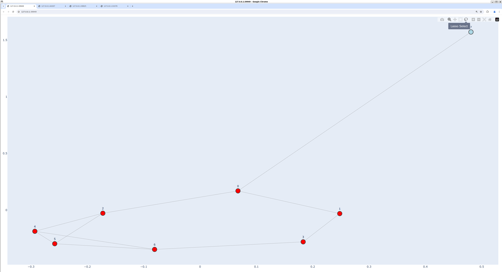
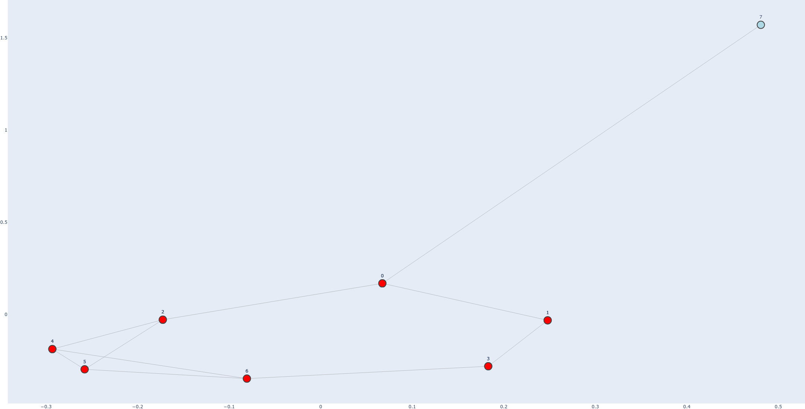
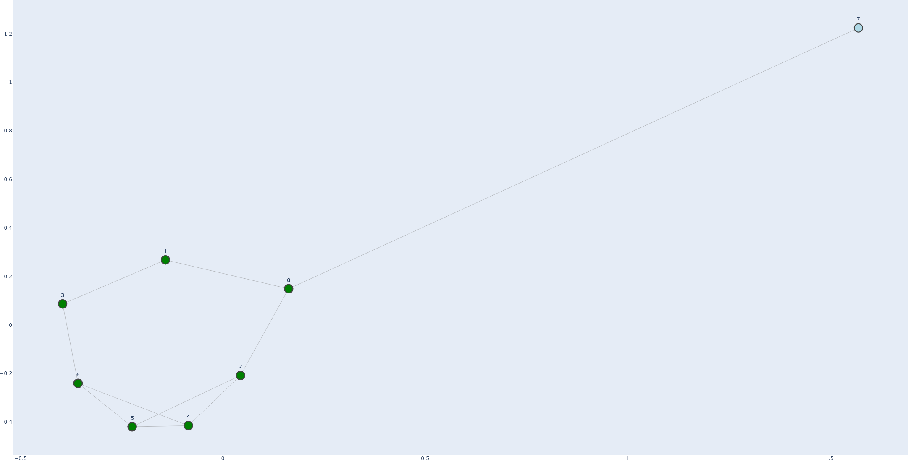
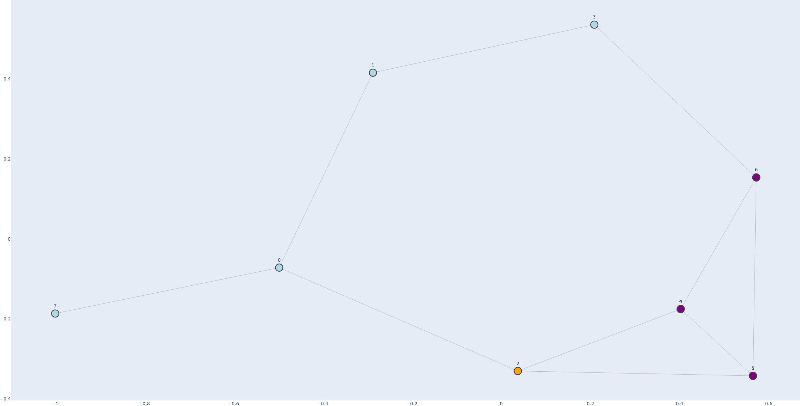
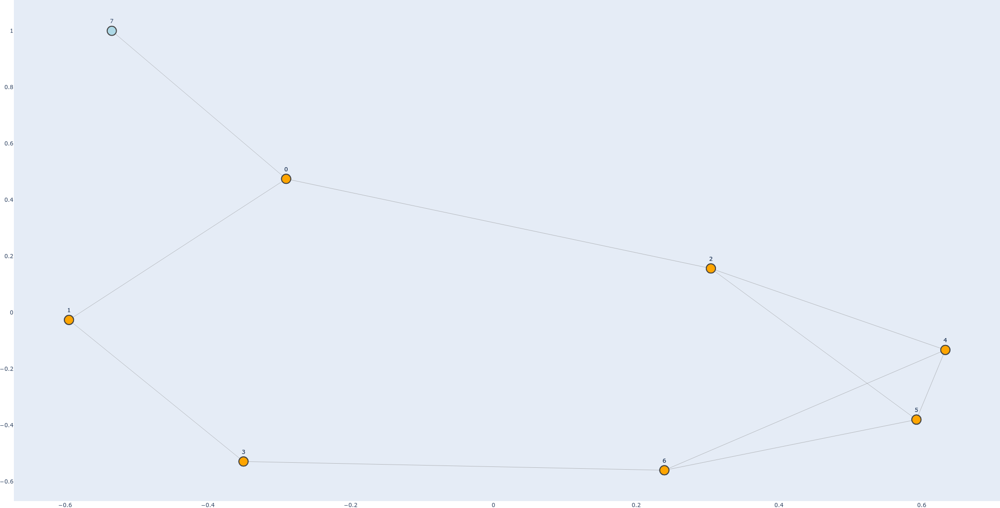
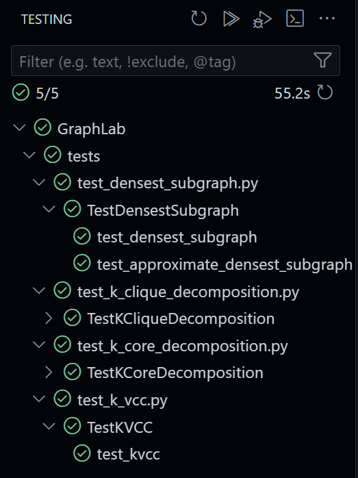

# 图挖掘算法的实现与验证 实验报告

李知非 2022200862

> 本实验已在 [GitHub](https://github.com/andylizf/GraphLab) 上开源，欢迎查看。

## 目录

1. [实验目的](#1-实验目的)
2. [实验内容](#2-实验内容)
3. [项目结构](#3-项目结构)
4. [算法实现](#4-算法实现)
    1. [图的读写](#图的读写)
    2. [k-core分解](#1-k-core分解)
    3. [最密子图](#2-最密子图)
    4. [k-clique分解](#3-k-clique分解)
    5. [k-vcc分解](#4-k-vcc分解)
5. [图的可视化](#5-图的可视化)
6. [测试与验证](#6-测试与验证)
    1. [测试用例：`test_kvcc.py`](#测试用例test_kvccpy)
7. [总结与展望](#7-总结与展望)

## 1. 实验目的

本实验旨在通过实现图的存储、读写、结构挖掘算法和可视化来加深对图算法的理解，并掌握如何在实际工程项目中应用这些算法。同时，通过将Python实现与C++实现进行对比，验证算法的正确性和效率。

## 2. 实验内容

本实验内容包括以下几部分：

1. 实现图的存储结构，支持图的创建、节点和边的添加与删除。
2. 实现从文件读取图的节点和边信息，并将图数据写入文件。
3. 实现多种图结构挖掘算法，包括k-core分解、最密子图、近似最密子图、k-clique分解和k-vcc分解。
4. 实现图的可视化，支持节点和边的样式设置以及交互功能。
5. 通过详细的测试用例验证算法的正确性，并与C++实现进行对比。

## 3. 项目结构

项目采用模块化设计，结构如下：

```
GraphLab/
├── data/                   # 数据集
│   ├── Amazon.txt
│   ├── CondMat.txt
│   ├── Gowalla.txt
├── graphmaster/            # 图算法实现模块
│   ├── graph.py
│   ├── __init__.py
│   └── __pycache__/        # 缓存文件
├── handouts/               # 任务书
│   └── 算法课期末大作业.pdf
├── main.py                 # 主程序入口
├── report/                 # 报告文档
└── tests/                  # 测试模块
    ├── __init__.py
    ├── test_densest_subgraph.py
    ├── test_k_clique_decomposition.py
    ├── test_k_core_decomposition.py
    ├── test_k_vcc.py
    └── third-party/        # 第三方实现
        ├── densest_subgraph/
        └── k_vcc/
```

## 4. 算法实现

### 图的读写

图的读写是图操作的基础，通过对图的存储结构进行封装，可以方便地实现节点和边的添加、删除、读取和保存。

**图的加载**

通过读取文件，将文件中的节点和边信息解析并添加到图中。为了保证节点和边的唯一性，使用映射来管理节点。

```python
def load(self, file_path):
    with open(file_path, "r") as f:
        lines = f.readlines()
        for i, line in enumerate(lines):
            if not line.startswith("#"):
                lines = lines[i:]
                break

        for line in lines:
            numbers = re.findall(r"\d+", line)
            if len(numbers) >= 2:
                u, v = map(int, numbers[:2])
                self.add_edge(u, v)
```

**图的保存**

将图中的节点和边信息保存到文件中，以便后续使用。

```python
def save(self, output_path):
    with open(output_path, "w") as f:
        for edge in self.graph.edges():
            u, v = edge
            original_u, original_v = (
                self.reverse_mapping[u],
                self.reverse_mapping[v],
            )
            f.write(f"{original_u} {original_v}\n")
```

### 1. k-core分解

**算法说明**：
k-core分解是一种用于识别网络中节点的稳健性和紧密性的算法。k-core是一个最大子图，在该子图中，每个节点至少连接有k个其他节点。k-core分解的过程是递归地移除度数小于k的节点，直到图中所有剩余节点的度数都大于等于k。

**伪代码**：
```
function k_core(graph, k):
    subgraph = graph.copy()
    while true:
        nodes_to_remove = []
        for each node in subgraph:
            if degree(node) < k:
                nodes_to_remove.append(node)
        if nodes_to_remove is empty:
            break
        subgraph.remove_nodes(nodes_to_remove)
    return subgraph.nodes()
```

**Python实现**：
```python
def k_core(self, k):
    subgraph = self.graph.copy()
    while True:
        nodes_to_remove = [node for node, degree in subgraph.degree if degree < k]
        if not nodes_to_remove:
            break
        subgraph.remove_nodes_from(nodes_to_remove)
    k_core_nodes = subgraph.nodes()
    return [self.reverse_mapping[node] for node in k_core_nodes]
```

### 2. 最密子图

**算法说明**：
最密子图是图中具有最高边密度的子图。为了找到最密子图，可以使用最大流算法。通过构建流网络，并在网络上运行最小割算法来识别密度最大的子图。

**伪代码**：
```
function densest_subgraph(graph):
    S = "source"
    T = "sink"
    m = number_of_edges(graph)
    n = number_of_nodes(graph)
    
    function construct_flow_network(g):
        flow_graph = create_directed_graph()
        flow_graph.add_node(S)
        flow_graph.add_node(T)
        for each edge (u, v) in graph:
            flow_graph.add_edge(u, v, capacity=1)
            flow_graph.add_edge(v, u, capacity=1)
        for each node in graph:
            d_i = degree(node)
            flow_graph.add_edge(S, node, capacity=m)
            flow_graph.add_edge(node, T, capacity=m + 2 * g - d_i)
        return flow_graph
    
    function find_min_cut(flow_graph):
        cut_value, partition = minimum_cut(flow_graph, S, T)
        return partition[0] - {S}, partition[1] - {T}, cut_value

    l, u = 0, m
    xtol = 1 / (n * (n - 1))
    while u - l >= xtol:
        g = (u + l) / 2
        flow_graph = construct_flow_network(g)
        V1, _, _ = find_min_cut(flow_graph)
        if V1 is not empty:
            l = g
        else:
            u = g

    final_flow_graph = construct_flow_network(l)
    V1, _, _ = find_min_cut(final_flow_graph)
    return V1
```

**Python实现**：
```python
def densest_subgraph(self):
    S = "S"
    T = "T"
    m = self.graph.number_of_edges()
    n = self.graph.number_of_nodes()

    def construct_flow_network(g):
        flow_graph = nx.DiGraph()
        flow_graph.add_node(S)
        flow_graph.add_node(T)

        for u, v in self.graph.edges():
            flow_graph.add_edge(u, v, capacity=1)
            flow_graph.add_edge(v, u, capacity=1)

        for node, d_i in self.graph.degree:
            flow_graph.add_edge(S, node, capacity=m)
            flow_graph.add_edge(node, T, capacity=m + 2 * g - d_i)

        return flow_graph

    def find_min_cut(flow_graph):
        cut_value, partition = nx.minimum_cut(flow_graph, S, T)
        reachable, non_reachable = partition
        return reachable - {S}, non_reachable - {T}, cut_value

    l, u = 0, m
    xtol = 1 / (n * (n - 1))
    while u - l >= xtol:
        g = (u + l) / 2
        flow_graph = construct_flow_network(g)
        V1, _, _ = find_min_cut(flow_graph)

        if len(V1) != 0:
            l = g
        else:
            u = g

    V1 = find_min_cut(construct_flow_network(l))[0]
    return [self.reverse_mapping[node] for node in V1], Graph.density(
        self.graph.subgraph(V1)
    )
```

### 3. k-clique分解

**算法说明**：
k-clique分解用于在图中查找所有包含k个节点的完全子图。使用Bron-Kerbosch算法进行最大团的查找，然后过滤出包含k个节点的子图。

**伪代码**：
```
function bron_kerbosch(R, P, X, cliques):
    if P and X are both empty:
        cliques.append(R)
        return
    for each vertex in P:
        bron_kerbosch(R union {vertex}, P intersect neighbors(vertex), X intersect neighbors(vertex), cliques)
        P.remove(vertex)
        X.add(vertex)

function find_maximal_cliques(graph):
    cliques = []
    bron_kerbosch(set(), set(graph.nodes()), set(), cliques)
    return cliques

function k_clique_decomposition(graph, k):
    cliques = find_maximal_cliques(graph)
    k_cliques = filter(clique for clique in cliques if size(clique) == k)
    return k_cliques
```

**Python实现**：
```python
def bron_kerbosch(self, r, p, x, cliques):
    if not p and not x:
        cliques.append(r)
        return
    for v in list(p):
        self.bron_kerbosch(
            r | {v},
            p & set(self.graph.neighbors(v)),
            x & set(self.graph.neighbors(v)),
            cliques,
        )
        p.remove(v)
        x.add(v)

def find_maximal_cliques(self):
    cliques = []
    self.bron_kerbosch(set(), set(self.graph.nodes()), set(), cliques)
    return cliques

def k_clique_decomposition(self, k):
    cliques = self.find_maximal_cliques()
    k_cliques = [clique for clique in cliques if len(clique) == k]
    k_cliques = [
        [self.reverse_mapping[node] for node in clique] for clique in k_cliques
    ]
    return k_cliques
```

### 4. k-vcc分解

**算法说明**：
k-vcc分解用于找到图中所有的k-顶点连通分量。k-顶点连通分量是指任意移除k-1个顶点后，图仍然保持连通。使用全局割和重叠分区的思想，通过递归方式找到所有k-vcc。

**伪代码**：
```
function global_cut(graph, k):
    for each pair of nodes (u, v):
        if node_connectivity(u, v) < k:
            cutset = minimum_node_cut(u, v)
            if size(cutset) < k:
                return cutset
    return null

function overlap_partition(graph, S):
    subgraphs = []
    graph.remove_nodes(S)
    for each component in connected_components(graph):
        component_with_S = component union S
        subgraph = subgraph_of(graph, component_with_S)
        subgraphs.append(subgraph)
    return subgraphs

function kvcc_enum(graph, k):
    k_vccs = []
    G_k_core = k_core_decomposition(graph, k)
    for each component in connected_components(G_k_core):
        cutset = global_cut(subgraph_of(G_k_core, component), k)
        if cutset is null:
            k_vccs.append(subgraph_of(G_k_core, component))
            break
        subgraphs = overlap_partition(subgraph_of(G_k_core, component), cutset)
        for each subgraph in subgraphs:
            k_vccs.extend(kvcc_enum(subgraph, k))
    return k_vccs

function k_vcc(graph, k):
    k_vccs = kvcc_enum(graph, k)
    return k_vccs
```

**Python实现**：
```python
@staticmethod
def global_cut(graph, k):
    for u in graph.nodes():
        for v in graph.nodes():
            if u != v and nx.node_connectivity(graph, u, v) < k:
                cutset = nx.minimum_node_cut(graph, u, v)
                if len(cutset) < k:
                    return cutset
    return None

@staticmethod
def overlap_partition(graph, S):
    subgraphs = []
    graph.remove_nodes_from(S)
    for component in nx.connected_components(graph):
        component_with_S = set(component) | S
        subgraph = graph.subgraph(component_with_S).copy()
        subgraphs.append(subgraph)
    return subgraphs

@staticmethod
def kvcc_enum(graph, k):
    k_vccs = []
    G_k_core = nx.k_core(graph, k)
    for component in nx.connected_components(G_k_core):
        cutset = Graph.global_cut(G_k_core.subgraph(component), k)
        if not cutset:
            k_vccs.append(G_k_core)
            break
        subgraphs = Graph.overlap_partition(G_k_core.subgraph(component), cutset)
        for subgraph in subgraphs:
            k_vccs.extend(Graph.kvcc_enum(subgraph, k))
    return k_vccs

def k_vcc(self, k):
    k_vccs = Graph.kvcc_enum(self.graph, k)
    k_vccs = [
        [self.reverse_mapping[node] for node in k_vcc.nodes()] for k_vcc in k_vccs
    ]
    return k_vccs
```

### 5. 图的可视化

为了更直观地展示图结构和算法结果，我们实现了图的可视化功能，使用 `plotly` 库来绘制图形，并支持高亮显示特定节点和团，提供了动态交互功能，如拖拽、缩放等。



在可视化过程中，我们特别关注了四种算法的结果展示，支持高亮显示算法运行结果，并动态交互。

```python
def visualize(
    self,
    highlight_nodes=None,
    secondary_highlight_nodes=None,
    highlight_cliques=None,
    node_color="lightblue",
    node_size=20,
    edge_color="gray",
    with_labels=True,
):
    pos = nx.spring_layout(self.graph, k=0.3, iterations=100)

    if highlight_nodes:
        center_x = np.mean([pos[node][0] for node in highlight_nodes])
        center_y = np.mean([pos[node][1] for node in highlight_nodes])
        center = np.array([center_x, center_y])

        contraction_factor = 0.5
        for node in highlight_nodes:
            pos[node] = center + contraction_factor * (pos[node] - center)

        expansion_factor = 1.5
        for node in set(self.graph.nodes()) - set(highlight_nodes):
            pos[node] = center + expansion_factor * (pos[node] - center)

    edge_x, edge_y = [], []
    for edge in self.graph.edges():
        x0, y0 = pos[edge[0]]
        x1, y1 = pos[edge[1]]
        edge_x += [x0, x1, None]
        edge_y += [y0, y1, None]

    edge_trace = go.Scatter(
        x=edge_x,
        y=edge_y,
        line=dict(width=0.5, color=edge_color),
        hoverinfo="none",
        mode="lines",
    )

    node_x, node_y = zip(*pos.values())
    node_trace = go.Scatter(
        x=node_x,
        y=node_y,
        mode="markers+text" if with_labels else "markers",
        marker=dict(size=node_size, color=node_color, line_width=2),
        text=list(self.graph.nodes()) if with_labels else None,
        hoverinfo="text" if with_labels else "none",
        textposition="top center" if with_labels else None,
    )

    fig = go.Figure(
        data=[edge_trace, node_trace],
        layout=go.Layout(
            showlegend=False,
            hovermode="closest",
            margin=dict(b=0, l=0, r=0, t=0),
            xaxis=dict(showgrid=False, zeroline=False),
            yaxis=dict(showgrid=False, zeroline=False),
        ),
    )

    if highlight_nodes:
        highlight_x, highlight_y = zip(*[pos[node] for node in highlight_nodes])
        highlight_trace = go.Scatter(
            x=highlight_x,
            y=highlight_y,
            mode="markers+text" if with_labels else "markers",
            marker=dict(size=node_size, color="red", line_width=2),
            text=highlight_nodes if with_labels else None,
            hoverinfo="text" if with_labels else "none",
            textposition="top center" if with_labels else None,
        )
        fig.add_trace(highlight_trace)

    if secondary_highlight_nodes:
        secondary_highlight_x, secondary_highlight_y = zip(
            *[pos[node] for node in secondary_highlight_nodes]
        )
        secondary_highlight_trace = go.Scatter(
            x=secondary_highlight_x,
            y=secondary_highlight_y,
            mode="markers+text" if with_labels else "markers",
            marker=dict(size=node_size, color="green", line_width=2),
            text=secondary_highlight_nodes if with_labels else None,
            hoverinfo="text" if with_labels else "none",
            textposition="top center" if with_labels else None,
        )
        fig.add_trace(secondary_highlight_trace)

    colors = itertools.cycle(
        ["orange", "purple", "cyan", "magenta", "yellow", "green", "blue", "red"]
    )
    if highlight_cliques:
        for clique in highlight_cliques:
            color = next(colors)
            clique_x, clique_y = zip(*[pos[node] for node in clique])
            clique_trace = go.Scatter(
                x=clique_x,
                y=clique_y,
                mode="markers+text" if with_labels else "markers",
                marker=dict(size=node_size, color=color, line_width=2),
                text=clique if with_labels else None,
                hoverinfo="text" if with_labels else "none",
                textposition="top center" if with_labels else None,
            )
            fig.add_trace(clique_trace)

    fig.show()
```

为了展示四种算法的结果，我们在 tiny.txt 图上运行了这四种算法，并将结果可视化。
原数据与输出结果保存在[report/tiny_data](./tiny_data)文件夹中。

- k-core分解可视化：
    ```shell
    python main.py data/tiny.txt k_core --k 2 --visualize --with-labels
    ```
    

- 最密子图可视化：
    ```shell
    python main.py data/tiny.txt densest_subgraph --k 3 --visualize --with-labels
    ```
    

- k-clique分解可视化：
    ```shell
    python main.py data/tiny.txt k_clique_decomposition --k 2 --visualize
    ```
    

- k-vcc分解可视化：
    ```shell
    python main.py data/tiny.txt k_vcc --k 2 --visualize --with-labels
    ```
    

## 6. 测试与验证

为了确保实现的算法正确性，我们通过详细的单元测试用例对其进行验证。四种算法均在不同类型的随机图上进行了测试，包括Erdos-Renyi图、尺度无关图、小世界图和稀疏图，然后与 NetworkX 库的实现、或第三方 C++ 实现进行对比。

可以看到，所有算法在这些图上的表现都符合预期，能够正确找到对应的结构。这充分保证了我们实现的算法的正确性。



值得一提的是，我们还略加修改了 [panjd/KVCC](https://github.com/panjd123/KVCC) 的 C++ 实现（见 [tests/third-party/k_vcc](../tests/third-party/k_vcc)），作为我们的测试对照。经过测试，我们的 Python 实现能通过对 KVCC 的验证，且与 C++ 实现的结果一致，进一步证明了我们实现的正确性。

### 测试用例：`test_kvcc.py`

```python
import os
import unittest
import subprocess
from graphmaster.graph import Graph
import networkx as nx
from itertools import combinations


def run_cpp_program(graph_file, k, executable, cwd, output_file):
    result = subprocess.run(
        [
            os.path.join(cwd, executable),
            "-g",
            graph_file,
            "-k",
            str(k),
            "-o",
            output_file,
        ],
        capture_output=True,
        text=True,
        check=True,
        cwd=cwd,
    )
    return result.stdout


def parse_cpp_output(output_file):
    with open(output_file, "r") as f:
        lines = f.readlines()

    kvccs = []
    current_kvcc = []
    for line in lines:
        if line.startswith("Node num"):
            if current_kvcc:
                kvccs.append(current_kvcc)
                current_kvcc = []
        else:
            try:
                nodes = list(map(int, line.split()))
                if nodes:
                    current_kvcc.extend(nodes)
            except ValueError:
                continue  # Ignore lines that can't be parsed
    if current_kvcc:
        kvccs.append(current_kvcc)
    return kvccs


class TestKVCC(unittest.TestCase):

    @classmethod
    def setUpClass(cls):
        cls.cwd = os.path.join(os.path.dirname(__file__), "third-party", "k_vcc")
        cls.executable = os.path.join(cls.cwd, "kvcc_baseline")
        cls.output_file = os.path.join(cls.cwd, "kvcc_output.txt")

        try:
            result = subprocess.run(
                ["make"],
                check=True,
                stderr=subprocess.PIPE,
                stdout=subprocess.PIPE,
                cwd=cls.cwd,
            )
        except subprocess.CalledProcessError as e:
            print("Compilation failed:")
            print(e.stderr.decode())
            raise

    @classmethod
    def tearDownClass(cls):
        try:
            subprocess.run(
                ["make", "clean"],
                check=True,
                stderr=subprocess.PIPE,
                stdout=subprocess.PIPE,
                cwd=cls.cwd,
            )
        except subprocess.CalledProcessError as e:
            print("Clean up failed:")
            print(e.stderr.decode())
            raise
        if os.path.exists(cls.output_file):
            os.remove(cls.output_file)

    def setUp(self):
        self.num_nodes = 20
        self.edge_prob = 0.05
        self.k = 3
        self.graphs = {
            "erdos_renyi": nx.erdos_renyi_graph(self.num_nodes, self.edge_prob),
            "scale_free": nx.barabasi_albert_graph(self.num_nodes, 3),
            "small_world": nx.watts_strogatz_graph(self.num_nodes, 4, 0.1),
            "sparse": nx.gnm_random_graph(self.num_nodes, 15),
        }
        self.graph_instances = {
            name: self.create_graph_instance(g) for name, g in self.graphs.items()
        }

    def create_graph_instance(self, nx_graph):
        g = Graph()
        for u, v in nx_graph.edges():
            g.add_edge(u, v)
        return g

    def save_graph_to_file(self, graph, filename):
        with open(filename, "w") as f:
            f.write(f"{graph.number_of_nodes()} {graph.number_of_edges()}\n")
            for u, v in graph.edges():
                f.write(f"{u + 1} {v + 1}\n")

    def verify_kvcc(self, k_vcc, k):
        for subset in combinations(k_vcc.nodes, k - 1):
            subgraph = k_vcc.copy()
            subgraph.remove_nodes_from(subset)
            if not nx.is_connected(subgraph):
                return False
        return True

    def verify_maximality(self, graph, k_vcc, k):
        nodes = set(k_vcc)
        for node in graph.nodes:
            if node not in nodes:
                new_nodes = nodes | {node}
                subgraph = graph.subgraph(new_nodes).copy()
                if self.verify_kvcc(subgraph, k):
                    return False
        return True

    def verify_kvcc_results(self, graph, k_vccs, k):
        for k_vcc in k_vccs:
            if not self.verify_kvcc(graph.subgraph(k_vcc), k):
                return False
            if not self.verify_maximality(graph, k_vcc, k):
                return False
        return True

    def test_kvcc(self):
        for graph_name, graph in self.graphs.items():
            with self.subTest(graph=graph_name):
                graph_wrapper = self.create_graph_instance(graph)

                python_kvccs = graph_wrapper.k_vcc(self.k)
                self.assertTrue(self.verify_kvcc_results(graph, python_kvccs, self.k))

                graph_file = os.path.join(self.cwd, f"{graph_name}.txt")
                self.save_graph_to_file(graph, graph_file)

                run_cpp_program(
                    graph_file, self.k, self.executable, self.cwd, self.output_file
                )
                cpp_kvccs = parse_cpp_output(self.output_file)
                cpp_kvccs = [
                    [node - 1 for node in kvcc] for kvcc in cpp_kvccs
                ]

                for python_kvcc in python_kvccs:
                    self.assertIn(sorted(python_kvcc), sorted(cpp_kvccs))

                os.remove(graph_file)

if __name__ == "__main__":
    unittest.main()
```

## 7. 总结与展望

通过本次实验，我们成功实现了多个图挖掘算法，并通过详细的测试验证了它们的正确性。项目采用模块化设计，具备良好的扩展性和可维护性。在未来的工作中，我们可以进一步优化算法的性能，探索更多图挖掘算法，并将其应用于实际的图数据分析中。

本实验不仅加深了我们对图算法的理解，也提升了我们在实际工程项目中应用这些算法的能力。通过与C++实现的对比，我们对算法的正确性和效率有了更深刻的认识，为未来的研究和应用奠定了坚实的基础。通过`plotly`库的可视化功能，我们能够直观地展示算法的运行结果，增强了算法结果的解释性和易用性。